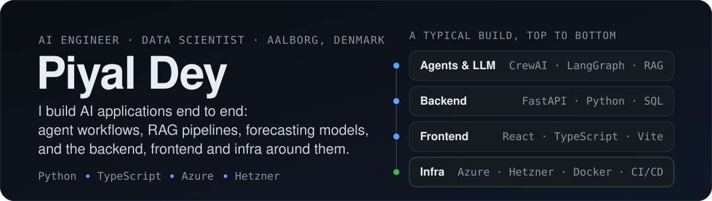
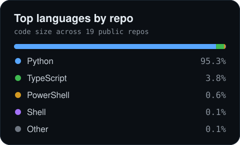
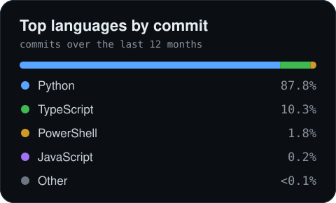

<!-- Profile README · github.com/PD-BDS -->

  

  
  
  

## About me

I'm an AI engineer at [Plant Supervision](https://github.com/Plant-Supervision) in Aalborg, Denmark. I build AI applications end to end: the LLM and agent layer, the backend it runs on, the frontend people actually use, and the deployment that keeps it all running. Most days that means Python and TypeScript, with Azure and Hetzner underneath.

Alongside work I'm finishing an MSc in Business Data Science at Aalborg University. My thesis looks at gender bias in LLM-based resume screening: where it creeps in (embeddings, retrieval, prompts, writing style) and what actually reduces it. Before moving to Denmark I spent three years in retail and SME banking in Bangladesh, so I tend to think about AI from the business side as much as the technical one.

What I work with most:

- Agent workflows and RAG: CrewAI, LangGraph, LangChain, ChromaDB, OpenAI and Claude models
- Backends in FastAPI, frontends in React and TypeScript
- Shipping and running things: Azure, Hetzner, Docker, GitHub Actions
- Forecasting and classic ML (PyTorch, TensorFlow, scikit-learn) when that's the right tool

I'm a Microsoft Certified Azure Data Scientist Associate (DP-100). Away from the keyboard I play classical guitar, like old towns and mountains, and cook a lot of Thai, Italian and Indian food.

## Tools I use

  

| | |
|:--|:--|
| **LLMs & agents** |           |
| **ML & deep learning** |        |
| **Backend & frontend** |        |
| **Cloud & delivery** |       |
| **Data** |        |

## Things I've built

**[HireX](https://github.com/PD-BDS/HireX)** · in production at Plant Supervision 
A recruitment assistant. A CrewAI crew screens resumes against a job description, and recruiters can ask follow-up questions about any candidate through RAG. State is kept on Azure Files so nothing is lost when the app redeploys. 
`CrewAI` `LangChain` `ChromaDB` `FastAPI` `React` `TypeScript` `Azure`

**[Gender bias in agentic resume screening](https://github.com/PD-BDS/Test_bias)** · MSc thesis 
Six research questions across five layers of an LLM screening pipeline: embedding retrieval, LLM screening, input format, prompt design and writing style. Bias is measured with SPD, DI, EOD and CFG, then counterfactual augmentation, debiasing and calibration are tested as fixes. 
`Python` `ChromaDB` `RAG` `Pydantic`

**[CO₂ emission forecasting](https://github.com/PD-BDS/CO2-Emission-Render)** · MLOps 
An attention LSTM that forecasts Danish power-grid emissions six hours ahead. GitHub Actions re-runs the ETL every six hours and retrains the model when accuracy slips. FastAPI backend, Streamlit dashboard, hosted on Render. 
`PyTorch` `FastAPI` `Streamlit` `SQLite` `GitHub Actions`

**[AI agent for data analysis](https://github.com/PD-BDS/AI-Agent-for-Data-Analysis)** 
Upload a dataset and ask a question in plain English. A crew of agents writes the SQL, reads the result, drafts a short report and plots it. 
`CrewAI` `OpenAI` `SQLite` `Plotly` `Streamlit`

**[Deciphering BTC price movement](https://github.com/PD-BDS/Deciphering-BTC-Price-Movement)** · research 
Does online sentiment predict Bitcoin? BERT and FinBERT read Twitter, Google Trends and the Fear & Greed Index; LSTMs do the forecasting. Directional accuracy came out at 85 to 86% daily and 93 to 94% monthly. 
`TensorFlow` `Transformers` `LSTM` `scikit-learn`

**[Explainable AI on customer churn](https://github.com/PD-BDS/Explainable-AI-Study-on-Identifying-Factors-Affecting-Customer-Churn)** · research 
Compares feature-selection approaches (PCA, filter, wrapper, embedded) across random forest, XGBoost, SVM and logistic regression, with SHAP to explain the best model. Best F1 was about 0.91. 
`scikit-learn` `XGBoost` `SHAP` `SMOTE`

<b>A few more</b>

 

- **[AI Trip Planner](https://github.com/PD-BDS/AI-TripPlanner)**: two CrewAI crews turn a traveller profile into a day-by-day itinerary, using Serper and TripAdvisor for the legwork.
- **[AI Piano Learning Planner](https://github.com/PD-BDS/AI-Piano-Learning-Planner)**: a small crew that writes a practice plan from your level, goals and available time.
- **[AI Resume Shortlisting](https://github.com/PD-BDS/AI-Resume-Shorlisting-app)**: LLaMA 3.3 70B (via Groq) parses a job description and ranks candidates, with a short reason for each pick.
- **[Mental Health Status Classifier](https://github.com/PD-BDS/Mental-Health-Classifier)**: a fine-tuned BERT model that sorts free text into seven mental-health categories.
- **[Penguins Detector](https://github.com/PD-BDS/Penguins-detector)**: a species classifier with a daily GitHub Actions job that fetches new data and publishes the prediction.

## On GitHub

  <picture>
    <source media="(prefers-color-scheme: dark)" srcset="https://raw.githubusercontent.com/PD-BDS/PD-BDS/main/profile-3d-contrib/profile-night-green.svg">
    
  </picture>

  
  

Rebuilt daily by a GitHub Action. Notebook and generated HTML/CSS output are excluded from the language cards.

## Say hello

If you're working on agent systems, evaluation, or getting ML into production and want to compare notes, my inbox is open.

  
  

