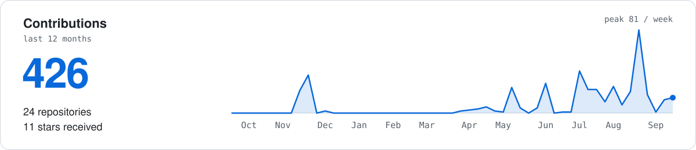
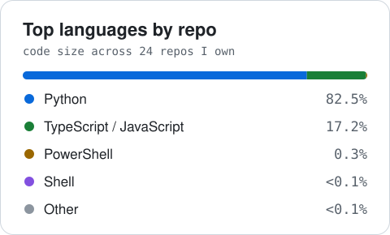
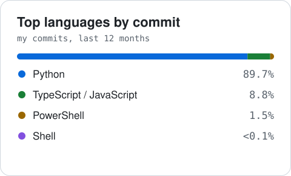

<!-- Profile README · github.com/PD-BDS -->

  <picture>
    <source media="(prefers-color-scheme: dark)" srcset="https://raw.githubusercontent.com/PD-BDS/PD-BDS/main/assets/readme/hero-dark.svg?v=3">
    
  </picture>

  
  
  

## About

I'm an AI Engineer at [Plant Supervision](https://plant-supervision.com/) in Aalborg, Denmark, where I design and ship AI applications end to end: LLM and agent workflows, retrieval pipelines, the FastAPI services behind them, React and Next.js front ends, and the infrastructure they run on. I build with Claude Code as a core part of my workflow — custom subagents, skills, hooks and MCP integrations that keep delivery test-first and reviewable.

**Focus areas**

- Agentic systems and retrieval: CrewAI, LangGraph, LangChain, ChromaDB, OpenAI and Claude models
- AI-assisted engineering with Claude Code: agent harnesses, custom subagents and skills, hooks, MCP servers
- Applied machine learning: forecasting, classification and explainability with PyTorch, TensorFlow and scikit-learn
- Delivery: FastAPI, React and TypeScript, Docker, Kubernetes, GitHub Actions, Azure and Hetzner

**Education**

- MSc Business Data Science — Aalborg University, Denmark. Thesis: gender bias in LLM-based resume screening and how embedding strategy, prompt design and calibration affect it.
- MSc Data Analytics & Design Thinking for Business — East Delta University

**Certification**

**Microsoft Certified: Azure Data Scientist Associate (DP-100)** 
Designing and running machine-learning solutions on Azure: data preparation, training, model management and deployment with Azure Machine Learning.

 

## Work at Plant Supervision

Products I have built as an AI Engineer since 2025.

**HireX** · AI-assisted candidate screening 
HireX is an AI application for candidate screening, developed at Plant Supervision ApS. It assists project managers in writing a proper job description from the client's needs and the requirements of the role. Candidate CVs are embedded and a RAG pipeline finds the top-matching candidates for each job. Project managers and recruiters can then analyse each matched candidate's profile, see the insights drawn from it and read why the candidate would be a good fit for the role.  
`FastAPI` `PostgreSQL` `LangGraph` `CrewAI` `ChromaDB` `React` `Azure`

**Assessk** · SaaS for ISO 12100 machinery risk assessment 
Assessk is a SaaS application for ISO 12100 machinery risk assessment with AI assistance. It takes a safety engineer through the complete assessment: project setup, hazard identification, risk estimation, reduction measures and the final report, delivered as a PDF. It works from the EU directives, the ISO standards and the Essential Health and Safety Requirements (EHSR). On that basis it suggests hazards, cites the relevant documents and standards, proposes measures to reduce risk and helps compile the report.
The application makes no autonomous decision. Its purpose is to give safety engineers a structured and focused workflow by taking on the tedious parts of the work. That means finding the matching standards, writing report content in the proper language with correct citations, and the reporting and other supporting tasks. Their time can then go on machine safety and their own critical thinking. 
`FastAPI` `LangGraph` `RAG` `Next.js` `TypeScript` `Docker` `Hetzner`

**Contractbook** · internal contract-lifecycle tool 
Contractbook is an internal contract-lifecycle application developed at Plant Supervision ApS for the company's own contract management. Users create contract templates and forms, so that one template can be reused across multiple parties. Contracts are drafted in a rich-text editor and signed electronically, and the application tracks the signing progress of each contract and files the finished documents. Every revision and every signature is recorded in a verifiable audit trail. It helps Legal team to create, filing and manage contracts. 
`FastAPI` `React` `TypeScript` `Vite` `Tailwind`

## Tools I use

  

| | |
|:--|:--|
| **LLMs & agents** |           |
| **ML & deep learning** |        |
| **Backend & frontend** |         |
| **Cloud & delivery** |        |
| **Data** |        |

## Open-source projects

**[Gender bias in agentic resume screening](https://github.com/PD-BDS/Test_bias)** · MSc thesis 
Six research questions across five layers of an LLM screening pipeline: embedding retrieval, LLM screening, input format, prompt design and writing style. Bias is measured with SPD, DI, EOD and CFG; counterfactual augmentation, debiasing and calibration are evaluated as mitigations. 
`Python` `ChromaDB` `RAG` `Pydantic`

**[CO₂ emission forecasting](https://github.com/PD-BDS/CO2-Emission-Render)** · MLOps 
An attention LSTM that forecasts Danish power-grid emissions six hours ahead. GitHub Actions re-runs the ETL every six hours and retrains the model when accuracy drops. FastAPI backend, Streamlit dashboard, hosted on Render. 
`PyTorch` `FastAPI` `Streamlit` `SQLite` `GitHub Actions`

**[AI agent for data analysis](https://github.com/PD-BDS/AI-Agent-for-Data-Analysis)** 
Upload a dataset and ask a question in plain English; a crew of agents writes the SQL, interprets the result, drafts a short report and plots it. 
`CrewAI` `OpenAI` `SQLite` `Plotly` `Streamlit`

**[Deciphering BTC price movement](https://github.com/PD-BDS/Deciphering-BTC-Price-Movement)** · research 
Does online sentiment predict Bitcoin? BERT and FinBERT read Twitter, Google Trends and the Fear & Greed Index; LSTMs forecast direction. Accuracy reached 85–86% daily and 93–94% monthly. 
`TensorFlow` `Transformers` `LSTM` `scikit-learn`

**[Explainable AI on customer churn](https://github.com/PD-BDS/Explainable-AI-Study-on-Identifying-Factors-Affecting-Customer-Churn)** · research 
Compares feature-selection approaches (PCA, filter, wrapper, embedded) across random forest, XGBoost, SVM and logistic regression, with SHAP to explain the best model. Best F1 ≈ 0.91. 
`scikit-learn` `XGBoost` `SHAP` `SMOTE`

<b>More</b>

 

- **[AI Trip Planner](https://github.com/PD-BDS/AI-TripPlanner)**: two CrewAI crews turn a traveller profile into a day-by-day itinerary, using Serper and TripAdvisor for research.
- **[AI Piano Learning Planner](https://github.com/PD-BDS/AI-Piano-Learning-Planner)**: a small crew that writes a practice plan from level, goals and available time.
- **[AI Resume Shortlisting](https://github.com/PD-BDS/AI-Resume-Shorlisting-app)**: LLaMA 3.3 70B (via Groq) parses a job description and ranks candidates with a reason for each pick.
- **[Mental Health Status Classifier](https://github.com/PD-BDS/Mental-Health-Classifier)**: a fine-tuned BERT model that sorts free text into seven mental-health categories.
- **[Penguins Detector](https://github.com/PD-BDS/Penguins-detector)**: a species classifier with a daily GitHub Actions job that fetches new data and publishes the prediction.

## On GitHub

  <picture>
    <source media="(prefers-color-scheme: dark)" srcset="https://raw.githubusercontent.com/PD-BDS/PD-BDS/main/assets/readme/activity-dark.svg">
    
  </picture>

  <picture>
    <source media="(prefers-color-scheme: dark)" srcset="https://raw.githubusercontent.com/PD-BDS/PD-BDS/main/assets/readme/languages-by-repo-dark.svg">
    
  </picture>
  <picture>
    <source media="(prefers-color-scheme: dark)" srcset="https://raw.githubusercontent.com/PD-BDS/PD-BDS/main/assets/readme/languages-by-commit-dark.svg">
    
  </picture>

Rebuilt daily by a GitHub Action from my repositories. Notebook and generated HTML/CSS output are excluded; TypeScript and JavaScript are grouped.

## Contact

For roles, collaborations or a conversation about agent systems and production ML: [dey.piyal97@gmail.com](mailto:dey.piyal97@gmail.com) or [LinkedIn](https://www.linkedin.com/in/piyal-dey-711015128/).
